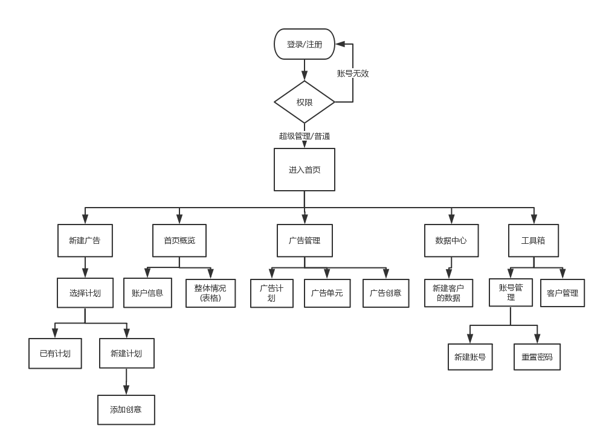

For a detailed explanation on how things work, check out the [guide](http://vuejs-templates.github.io/webpack/) and [docs for vue-loader](http://vuejs.github.io/vue-loader).

# 后台管理系统总结
## 本项目的脚手架用的是vue，首先vue适合做一些小的项目，而react适合做一些大的项目，其次是vue使用的是模板系统而不是jsx，使其更加容易管理。
## 使用es6语法是因为es5没有块级作用域，全局的变量会被污染，es5只有全局作用域和函数作用域，在实现继承上，es5通过原型链实现继承，es6引入了Class类这个概念，更像面向对象编程的语法，更方便代码编译的解析，还有利用es6的解构避免多次声明变量，增强代码负担
## 使用less来写样式，因为less结构清晰，便于扩展，可以实现多重继承;less是基于javascript运行，所以less是客户端运行，而sass是基于ruby在服务器处理。
## 在本次项目中运用最多的框架就是element-ui，主要是因为这个框架是我国一流的技术团队开发的，相对于其他的框架来说，element-ui的功能更加完善，而且代码出错率小，使用起来特别方便，能够提高我们的工作效率，节约时间。
## 路由的搭建，是在main.js上挂载router，在router文件夹中的index.js使用vue.use(router)
## 该项目分为新建广告，首页概览，广告管理，数据中心，工具盒，包括开始的登录页
   在广告管理中又分为广告计划，广告单元，广告创意，这几个页面之间是相互关联的关系。
   在进入首页之前会对用户进行判断，进行路由拦截，如果输入的用户名与密码与后台中的数据相匹配，那么就跳转到首页，将用户信息（token）存储到本地(localstorage).将信息显示到右上角。
## 首页
   在首页中会使用到element-ui，特别注意的是日期方面，使用日期组件时，在开始的时候,v-model绑定start,在结束的时候, v-model绑定end 接着定义两个时间,分别为开始时间和结束时间,然后设置一个默认的，开始的时间比结束的时间早 六个月,然后将开始的时间全部转换为月份,以及结束的时间都转换成月份！然后再通过用月份/12得到年份,再通过 %12得到月份,并且同事要判断一下,月份为12月的时候,再通过后台接口请求数据,这些数据是自己mock出来的一个数据！其次的图表使用的是eacharts,图表的数据是从后台请求的数据进行改变。
## 数据请求和接口
    数据的请求是封装的axios 首先创建一个instance的实例,interceptor拦截器必须在请求前设置才有效,直接为axios 全局对象创建interceptor,会导致全局的axios发出的请求或接受的响应都会被拦截到,所以要使用axios.create() 来创建单独的axios实例,即在本项目中创建的instance.请求接口是http://localhost:9000
    接口：是根据原型图的数据进行的模拟数据，不同的功能使用不同的接口进行开发
## 本次开发的核心是上传图片，广告管理，对于后台数据的请求以及接口的理解，难点是图片的上传，使用到了formdata,在进行数据的渲染时必须将数据的接口写对。其次就是表格上的数据在渲染时从后台获取数据。
## 在数据的管理是会用到store
## 注意：
    1.在本次开发过程中，在进行到路由方面都比较顺畅，但是在渲染数据跟请求接口方面还是又所欠缺，特别是对于接口的了解太少，以前也没怎么使用，需要不断的加强。
    2.多了解些前端开发的框架，不止使用一种。
    3.对于原型图的理解不够深刻，走了不少弯路。
    4.对于排版方面也许加强
